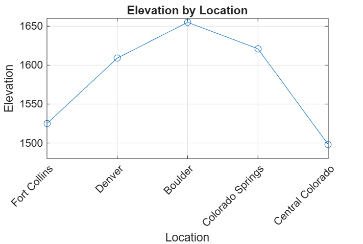

# MATLAB Geospatial Data Analyzer

A beginner MATLAB project that analyzes and visualizes sample geospatial elevation data for locations across Colorado.

## Overview

This project was built as a hands-on introduction to MATLAB with a focus on geospatial data analysis. The script stores geographic coordinates and elevation values, performs basic statistical analysis, identifies the highest-elevation observation, and visualizes the results.

## Visualization

The analyzer generates an elevation comparison plot for the sample Colorado locations.



## Features

- Stores latitude, longitude, elevation, and location data
- Calculates average, minimum, and maximum elevation
- Identifies the location associated with the maximum elevation
- Uses MATLAB indexing to connect elevation values with coordinates
- Produces formatted results in the Command Window
- Creates an elevation visualization by location

## MATLAB Concepts Practiced

- Vectors
- Variables
- Indexing
- `mean()`, `min()`, and `max()`
- Multiple function outputs
- `fprintf()`
- `plot()`
- Plot labels, ticks, and grid formatting

## Example Output

```text
MATLAB Geospatial Data Analyzer
--------------------------------
Average elevation: 1581.60
Highest elevation: 1655
Lowest elevation: 1498
Highest point latitude: 40.0150
Highest point longitude: -105.2705
Highest location: Boulder
